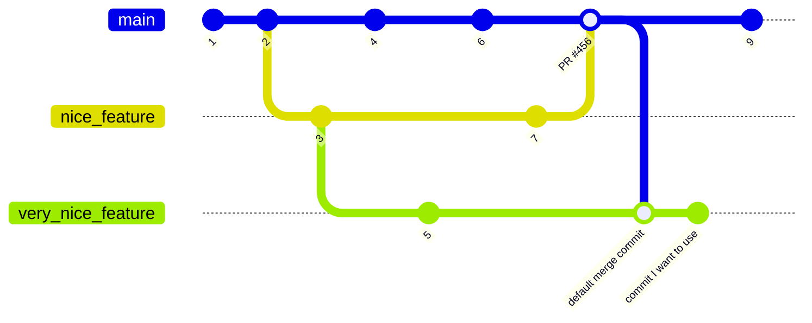

https://www.conventionalcommits.org/en/v1.0.0/#summary

remove a git merge message from history 
https://stackoverflow.com/questions/17577409/git-remove-merge-commit-from-history/48604371#48604371

```bash
git rebase --onto <commit I want to use> <default merge commit>
```

