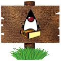
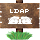

The JNDI Tutorial: Trail Map

[**_The JNDI Tutorial_**](index.html)

  

**Trail Map**  
Your guide to _The JNDI Tutorial_

> You can begin reading the tutorial sequentially, or visit only those trails that interest you. If you have questions about the tutorial (how to download it, when it was updated, how to give us feedback...), go to the tutorial's [first page.](index.html)

 

> 
> 
> **[Getting Started](getStarted/index.html)**     \[ [TOC](getStarted/TOC.html) \]
> 
> Start here to read an overview of naming and directory concepts and the JNDI. This trail also shows you how to write, compile, and run your first JNDI application. It will help you understand the rest of the material presented in this tutorial.
> 
> *   [Naming and Directory Concepts](getStarted/concepts/index.html)
> *   [JNDI Overview](getStarted/overview/index.html)
> *   [Examples](getStarted/examples/index.html)
> *   [Common Problems (and Their Solutions)](getStarted/faq/index.html)
> 
> 
> 
> **[The Basics](basics/index.html)**     \[ [TOC](basics/TOC.html) \]
> 
> These lessons teach you how to use the JNDI to perform naming and directory operations.
> 
> *   [Preparations](basics/prepare/index.html)
> *   [Naming Operations](basics/naming/index.html)
> *   [Directory Operations](basics/directory/index.html)
> 
> 
> 
> **[Beyond the Basics](beyond/index.html)**     \[ [TOC](beyond/TOC.html) \]
> 
> These lessons discuss advanced topics in the JNDI. These topics include a discussion on the relationship between URLs and the JNDI, federation, and event notification.
> 
> *   [What's in a Name](beyond/names/index.html)
> *   [Environment Properties](beyond/env/index.html)
> *   [Event Notification](beyond/event/index.html)
> *   [URLs](beyond/url/index.html)
> *   [Federation](beyond/fed/index.html)
> *   [Miscellaneous](beyond/misc/index.html)
> 
> 
> 
> **[Java Objects and the Directory](objects/index.html)**     \[  [TOC](objects/TOC.html) \]
> 
> These lessons show you how to integrate your application with the directory, so that you can store and retrieve Java objects to/from the directory.
> 
> *   [Storing Objects in the Directory](objects/storing/index.html)
> *   [State Factories](objects/state/index.html)
> *   [Reading Objects from the Directory](objects/reading/index.html)
> *   [Object Factories](objects/factory/index.html)
> *   [Representation in the Directory](objects/representation/index.html)
> 
> 
> 
> **[Tips for LDAP Users](ldap/index.html)**    \[  [TOC](ldap/TOC.html) \]
> 
> This trail contains special hints and tips for accessing the LDAP service through the JNDI.
> 
> *   [Comparison of the LDAP and JNDI Models](ldap/models/index.html)
> *   [Security](ldap/security/index.html)
> *   [Miscellaneous](ldap/misc/index.html)
> *   [Searches](ldap/search/index.html)
> *   [Referrals](ldap/referral/index.html)
> *   [Schema](ldap/schema/index.html)
> *   [Controls and Extensions](ldap/ext/index.html)
> *   [Connections](ldap/connect/index.html)
> *   [Frequently Asked Questions](ldap/faq/index.html)
> 
> 
> 
> **[Building a Service Provider](provider/index.html)**     \[ [TOC](provider/TOC.html) \]
> 
> Here's the information you need to create a JNDI service provider.
> 
> *   [The Big Picture](provider/overview/index.html)
> *   [The Ground Rules](provider/ground/index.html)
> *   [The Essential Pieces](provider/basics/index.html)
> *   [Adding Directory Support](provider/dir/index.html)
> *   [Adding URL Support](provider/url/index.html)
> *   [Adding Federation Support](provider/fed/index.html)
> *   [Miscellaneous](provider/misc/index.html)

 

* * *

All of the material in **_The JNDI Tutorial_** is [copyright](information/copyright.html)\-protected and may not be published in other works without express written permission from Sun Microsystems.